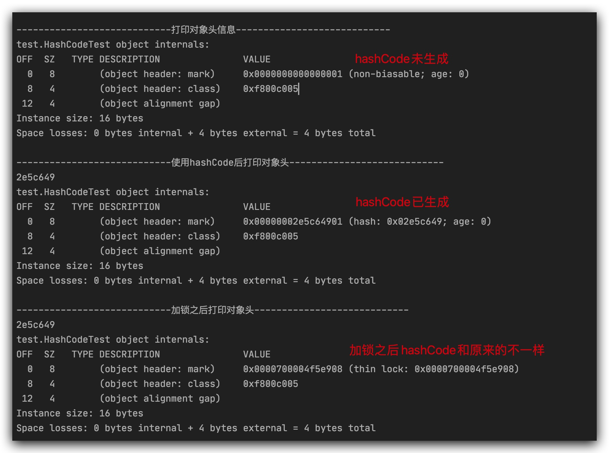

---
# 当前页面内容标题
title: Java源码-001-Object
# 当前页面图标
icon: java
# 分类
category:
  - Java
  - 源码
# 标签
tag:
  - Java
  - 源码
sticky: false
# 是否收藏在博客主题的文章列表中，当填入数字时，数字越大，排名越靠前。
star: false
# 是否将该文章添加至文章列表中
article: true
# 是否将该文章添加至时间线中
timeline: true
---

# Java源码-001-Object

::: tip

我们都知道`Object`在`Java`中所有类的父类，但是我们从来没有显示的继承这个类，我们却可以调用它定义的方法。

🤔️：其他的类为什么可以调用`Object`类中的方法？

🤔️：`native`方法是什么？它又是怎么调用的？

🤔️：面试官为什么会经常问`hashCode`和`equals`两个方法，他的底层逻辑又是什么？

🤔️：`Object`类方法有什么用？

:::


::: warning

🤔️：其他的类为什么可以调用`Object`类中的方法？

🤔️：`native`方法是什么？它又是怎么调用的？

🤔️：面试官为什么会经常问`hashCode`和`equals`两个方法，他的底层逻辑又是什么？

🤔️：`Object`类方法有什么用？

:::

## 其他的类为什么可以调用`Object`类中的方法？

要知道为什么可以调用`Object`类中的方法，先要知道为什么说`Object`类是所有方法的父类，在JDK1.7以前编译器在`.java`文件编译`.classs`时候完成了`Object`的织入，JDK1.7开始改成JVM完成`Object`的织入。让所有的`Java`类继承`Object`。

> tips: `Object`的织入方式？
>
> JDK1.6（包含）时编译器在编译`class`时处理
>
> JDK1.7（包含）后由`JVM`处理

```java
// JDK和JRE版本为1.6时 使用javap反编译得到，说明在编译为class文件时整个Object织入到其他类中
mingfangxu@mingfangxudeMacBook-Pro test % javap Test.class 
Compiled from "Test.java"
public class test.Test extends java.lang.Object {
  public test.Test();
  public static void main(java.lang.String[]);
}
mingfangxu@mingfangxudeMacBook-Pro test % 
  
  
// JDK和JRE版本为1.7时 使用javap反编译得到，说明织入已经不在编译期了，应该是class文件在JVM之后流程织入
mingfangxu@mingfangxudeMacBook-Pro test % javap Test.class
Compiled from "Test.java"
public class test.Test {
  public test.Test();
  public static void main(java.lang.String[]);
}
mingfangxu@mingfangxudeMacBook-Pro test % 

```

## `native`方法是什么？它又是怎么调用的？

`native`方法就是我们常说的本地方法，它的调用就是`JNI`调用，它通过约定规则调用`C++`代码，调用方式由两种。一种是直接根据`JNI`规则去调用，另一种是`registerNatives`注册，在`C++`通过映射完成调用。

[详解Java中native方法的使用](https://www.jb51.net/article/195760.htm)

> ⚠️：JNI命名规则是Java+包名+类名+方法名
>
> ⚠️：调用方式
>
> - 直接调用
> - 注册调用

```c++
#include <stdio.h>
#include <signal.h>
#include <limits.h>

#include "jni.h"
#include "jni_util.h"
#include "jvm.h"
#include "java_lang_Object.h"
// java Object类native方法参数映射的C++处理函数
static JNINativeMethod methods[] = {
   // Java方法       参数()返回值               C++处理函数
    {"hashCode",    "()I",                    (void *)&JVM_IHashCode},
    {"wait",        "(J)V",                   (void *)&JVM_MonitorWait},
    {"notify",      "()V",                    (void *)&JVM_MonitorNotify},
    {"notifyAll",   "()V",                    (void *)&JVM_MonitorNotifyAll},
    {"clone",       "()Ljava/lang/Object;",   (void *)&JVM_Clone},
};
// 本地方法(JNI)调用完成注册,  JNI命名规则 Java_java_lang_Object_registerNatives
JNIEXPORT void JNICALL
Java_java_lang_Object_registerNatives(JNIEnv *env, jclass cls)
{
    (*env)->RegisterNatives(env, cls,
                            methods, sizeof(methods)/sizeof(methods[0]));
}
// 本地方法(JNI)调用完成注册,  JNI命名规则 Java_java_lang_Object_getClass
JNIEXPORT jclass JNICALL
Java_java_lang_Object_getClass(JNIEnv *env, jobject this)
{
    if (this == NULL) {
        JNU_ThrowNullPointerException(env, NULL);
        return 0;
    } else {
        return (*env)->GetObjectClass(env, this);
    }
}
```

## `Object`核心方法

### `hashCode`

`hashCode`不是内存地址，它是在保存在对象头`markword`中，对象创建时它不是立刻创建，是需要的时候才会创建。

#### 对象头结构

[Java对象头结构图解](https://mikechen.cc/15181.html)

#### 对象头打印信息



#### `hashCode`生成

```C++
// HashCode生成
JVM_ENTRY(jint, JVM_IHashCode(JNIEnv* env, jobject handle))
  JVMWrapper("JVM_IHashCode");
	// 如果对象为NULL，则返回0
  return handle == NULL ? 0 : ObjectSynchronizer::FastHashCode (THREAD, JNIHandles::resolve_non_null(handle)) ;
JVM_END
  
  
  
// HashCode生成
intptr_t ObjectSynchronizer::FastHashCode (Thread * Self, oop obj) {
  // 是否使用偏向锁
  if (UseBiasedLocking) {
    // 若对象处理偏向锁状态
    if (obj->mark()->has_bias_pattern()) {
      Handle hobj (Self, obj) ;
      assert (Universe::verify_in_progress() ||
              !SafepointSynchronize::is_at_safepoint(),
             "biases should not be seen by VM thread here");
      // 撤销偏向锁
      BiasedLocking::revoke_and_rebias(hobj, false, JavaThread::current());
      obj = hobj() ;
      assert(!obj->mark()->has_bias_pattern(), "biases should be revoked by now");
    }
  }

  assert (Universe::verify_in_progress() ||
          !SafepointSynchronize::is_at_safepoint(), "invariant") ;
  assert (Universe::verify_in_progress() ||
          Self->is_Java_thread() , "invariant") ;
  assert (Universe::verify_in_progress() ||
         ((JavaThread *)Self)->thread_state() != _thread_blocked, "invariant") ;

  ObjectMonitor* monitor = NULL;
  markOop temp, test;
  intptr_t hash;
  // 读取一个稳定的mark，若锁膨胀就等膨胀完再读
  markOop mark = ReadStableMark (obj);

  assert (!mark->has_bias_pattern(), "invariant") ;
  // 若mark是正常的，就是指是否撤销了偏向锁
  if (mark->is_neutral()) {
    //mark存在hash，直接取出返回
    hash = mark->hash();              // this is a normal header
    if (hash) {                       // if it has hash, just return it
      return hash;
    }
    // mark不存在hash，生成hash返回
    hash = get_next_hash(Self, obj);  // allocate a new hash code
    temp = mark->copy_set_hash(hash); // merge the hash code into header 生成hash放入对象头
    // use (machine word version) atomic operation to install the hash
    test = (markOop) Atomic::cmpxchg_ptr(temp, obj->mark_addr(), mark);
    if (test == mark) {
      return hash;
    }
	// 若mark中有monitor锁或者说锁升级了，mark里不在保存hash,保存monitor的地址，hash保存在monitor中
  } else if (mark->has_monitor()) {
    monitor = mark->monitor();
    temp = monitor->header();
    assert (temp->is_neutral(), "invariant") ;
    // 从monitor中取出返回
    hash = temp->hash();
    if (hash) {
      return hash;
    }
    // 若mark中有轻量级锁或者说锁升级了，mark里不在保存hash,保存helper的地址，hash保存在helper中
  } else if (Self->is_lock_owned((address)mark->locker())) {
    temp = mark->displaced_mark_helper(); // this is a lightweight monitor owned
    assert (temp->is_neutral(), "invariant") ;
    // 从helper中取出返回
    hash = temp->hash();              // by current thread, check if the displaced
    if (hash) {                       // header contains hash code
      return hash;
    }
  }

  // 锁膨胀为monitor
  monitor = ObjectSynchronizer::inflate(Self, obj);
  // 加载替换的头信息并检查它是否具有哈希代码
  mark = monitor->header();
  assert (mark->is_neutral(), "invariant") ;
  hash = mark->hash();
  if (hash == 0) {
    hash = get_next_hash(Self, obj);
    temp = mark->copy_set_hash(hash); // merge hash code into header
    assert (temp->is_neutral(), "invariant") ;
    // 获取
    test = (markOop) Atomic::cmpxchg_ptr(temp, monitor, mark);
    if (test != mark) {
      // 若添加了新的替换标头需要重新取hash值反回
      hash = test->hash();
      assert (test->is_neutral(), "invariant") ;
      assert (hash != 0, "Trivial unexpected object/monitor header usage.");
    }
  }
  return hash;
}
```

#### `hashCode`总结

- `hashCode`不是内存地址，而是通过算法生成`hashcode`保存在对象头的`markword`中。
- 由于在对象头的`markword`中与锁共用bit位导致，这就导致加锁之后`hashCode`变了或者说找不到了,整个数据都和锁的类型以及状态相关联。
- 若锁是偏向锁，调用`hashCode`时撤销偏向锁，对象变成无锁状态，生成`hashcode`保存在对象头的`markword`中。
- 若线程需要使用锁，造成锁的升级，`hashcode`随着`markword`一起转移到`monitor`或者`helper`中，需要就在`monitor`或者`helper`中取。

### `equals`

`Object`中`equals`比较的是内存地址，就是栈中保存的地址，这种场景下基本数据类型是可以比较的，相当于`==`，如果是引用类型，需要重写这个方法来比较堆中的值，通常`equals`和`hashCode`重写主要是为了在哈希表中使用，先比较`hashCode`,在比较具体的值。

```java
    /**
     * 对象相对判断
     * equals 方法在非空对象引用上实现相等关系：
     * 自反性：对于任何非空引用值 x，x.equals(x) 都应返回 true。
		 * 对称性：对于任何非空引用值 x 和 y，当且仅当 y.equals(x) 返回 true 时，x.equals(y) 才应返回 		true。
		 * 传递性：对于任何非空引用值 x、y 和 z，如果 x.equals(y) 返回 true，并且 y.equals(z) 返回 true，那么 x.equals(z) 应返回 true。
		 * 一致性：对于任何非空引用值 x 和 y，多次调用 x.equals(y) 始终返回 true 或始终返回 false，前提是对象上 equals 比较中所用的信息没有被修改。
		 * 对于任何非空引用值 x，x.equals(null) 都应返回 false。
		 * Object 类的 equals 方法实现对象上差别可能性最大的相等关系；即，对于任何非空引用值 x 和 y，当且仅当 x 和 y 引用同一个对象时，此方法才返回 true（x == y 具有值 true）。
		 * 注意：equals、hashCode通常都是一起重写
     */
    public boolean equals(Object obj) {
        return (this == obj);
    }
```

## `Object`源码

```java
package java.lang;
/**
 * 顶级父类Object
 */
public class Object {
    private static native void registerNatives();
    static {
    	// 注册本地方法,在对象初始化时调用
        registerNatives();
    }
    /**
		 * 表示此对象运行时类的 Class 对象。
     * 返回的 Class 对象是由所表示类的 static synchronized 方法锁定的对象。
     */
    public final native Class<?> getClass();
    /**
     * 返回对象的哈希码值。支持此方法是为了提高哈希表（例如 java.util.Hashtable 提供的哈希表）的性能。
		 * ⚠️：同一个对象hashCode相同。
		 * ⚠️：如果两个对象equals比较是相等的，那么他们的hashCode一定相同。
		 * ⚠️：如果两个对象equals比较不相等，那么他们的hashCode可以相同。
		 * ⚠️：不相等的对象生成不同的hashCode可以提高哈希表的性能。所以需要尽量避免hashCode相同
		 * 实际上，由 Object 类定义的 hashCode 方法确实会针对不同的对象返回不同的整数。
		 *（这一般是通过将该对象的内部地址转换成一个整数来实现的，但是 JavaTM 编程语言不需要这种实现技巧。）
     */
    public native int hashCode();
    /**
     * 对象相对判断
		 * 任何非空引用值 x 和 y，当且仅当 x 和 y 引用同一个对象时，此方法才返回 true
     */
    public boolean equals(Object obj) {
        return (this == obj);
    }

    /**
     * 创建对象副本
     * 约定：副本通过调用 super.clone 获得。
     * 如果一个类及其所有的超类（Object 除外）都遵守此约定，则 x.clone().getClass() == x.getClass()
     *
     * ⚠️：此对象的类不能实现接口 Cloneable，则会抛出 CloneNotSupportedException。
     * ⚠️：数组都被视为实现接口 Cloneable
     * ⚠️：如果存在对象引用此方法实现的是“浅拷贝”
     */
    protected native Object clone() throws CloneNotSupportedException;
    /**
     * 返回该对象的字符串表示。结果简明易于读懂。建议所有子类都重写此方法。
		 * Object 类的 toString 方法返回一个字符串，该字符串由类名、@和此对象哈希码的无符号十六进制表示组成。
     */
    public String toString() {
        return getClass().getName() + "@" + Integer.toHexString(hashCode());
    }
    /**
     * 唤醒在此对象监视器上等待的单个线程。
     * 如果所有线程都在此对象上等待，则会选择唤醒其中一个线程。选择是任意性的，并在对实现做出决定时发生。线程		 * 通过调用其中一个 wait 方法，在对象的监视器上等待。直到当前线程放弃此对象上的锁定，才能继续执行被唤醒		 * 的线程。被唤醒的线程将以常规方式与在该对象上主动同步的其他所有线程进行竞争
		 * 
		 * 线程可以成为此对象监视器的所有者：
     * ⚠️：通过执行此对象的同步实例方法。
     * ⚠️：通过执行在此对象上进行同步的 synchronized 语句的正文。
     * ⚠️：对于 Class 类型的对象，可以通过执行该类的同步静态方法。
		 * ⚠️：此方法只应由作为此对象监视器的所有者的线程来调用。一次只能有一个线程拥有对象的监视器。
     */
    public final native void notify();
    /**
     * 唤醒在此对象监视器上等待的所有线程。线程通过调用其中一个 wait 方法，在对象的监视器上等待。
		 * 直到当前线程放弃此对象上的锁定，才能继续执行被唤醒的线程。
		 * 被唤醒的线程将以常规方式与在该对象上主动同步的其他所有线程进行竞争
		 * ⚠️：此方法只应由作为此对象监视器的所有者的线程来调用
     */
    public final native void notifyAll();
    /**
     * 在其他线程调用此对象的 notify() 方法或 notifyAll() 方法，或者超过指定的时间量前，
     * 导致当前线程等待。
     */
    public final native void wait(long timeout) throws InterruptedException;
    public final void wait(long timeout, int nanos) throws InterruptedException {
        if (timeout < 0) {
            throw new IllegalArgumentException("timeout value is negative");
        }
        if (nanos < 0 || nanos > 999999) {
            throw new IllegalArgumentException(
                                "nanosecond timeout value out of range");
        }
        if (nanos > 0) {
            timeout++;
        }
        wait(timeout);
    }
    public final void wait() throws InterruptedException {
        wait(0);
    }
    /**
     * 当垃圾回收器确定不存在对该对象的更多引用时，由对象的垃圾回收器调用此方法。
     * 子类重写 finalize 方法，以配置系统资源或执行其他清除。
		 * finalize 的常规协定是：
		 * 当 JavaTM 虚拟机已确定尚未终止的任何线程无法再通过任何方法访问此对象时，将调用此方法，
		 * 除非由于准备终止的其他某个对象或类的终结操作执行了某个操作。finalize 方法可以采取任何操作，
		 * 其中包括再次使此对象对其他线程可用；不过，finalize 的主要目的是在不可撤消地丢弃对象之前执
		 * 行清除操作。例如，表示输入/输出连接的对象的 finalize 方法可执行显式 I/O 事务，
		 * 以便在永久丢弃对象之前中断连接。
		 * Object 类的 finalize 方法执行非特殊性操作；它仅执行一些常规返回。Object 的子类可以重写此定义。
		 * Java 编程语言不保证哪个线程将调用某个给定对象的 finalize 方法。
		 * 但可以保证在调用 finalize 时，调用 finalize 的线程将不会持有任何用户可见的同步锁定。
		 * 如果 finalize 方法抛出未捕获的异常，那么该异常将被忽略，并且该对象的终结操作将终止。
		 * 在启用某个对象的 finalize 方法后，将不会执行进一步操作，直到 Java 虚拟机再次确定尚
		 * 未终止的任何线程无法再通过任何方法访问此对象，其中包括由准备终止的其他对象或类执行的可能操作，
		 * 在执行该操作时，对象可能被丢弃。
		 * 对于任何给定对象，Java 虚拟机最多只调用一次 finalize 方法。
		 * finalize 方法抛出的任何异常都会导致此对象的终结操作停止，但可以通过其他方法忽略它。
     */
    protected void finalize() throws Throwable { }
}

```

