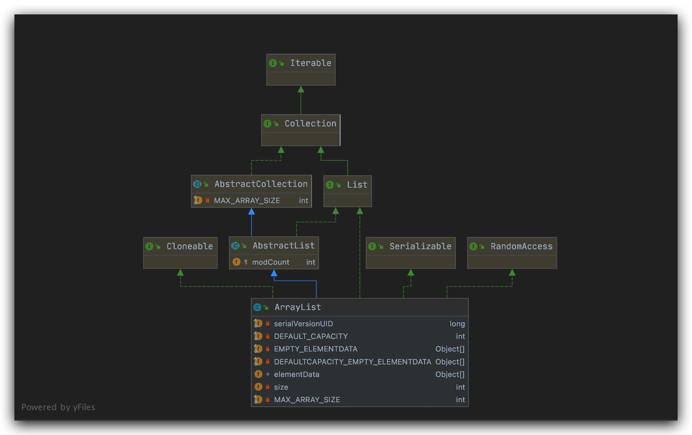
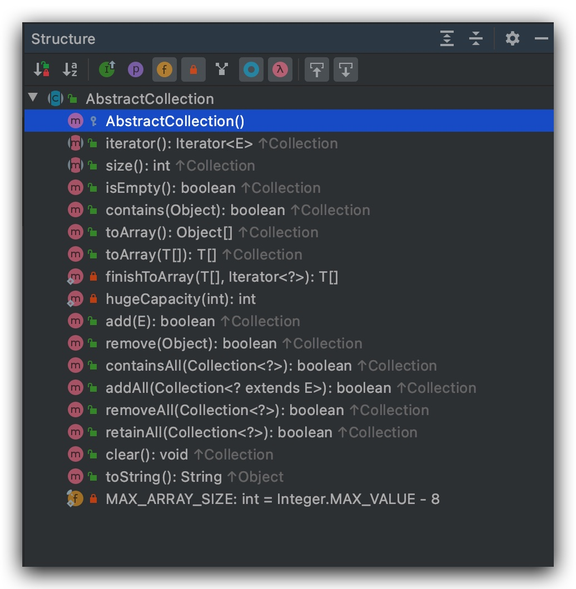
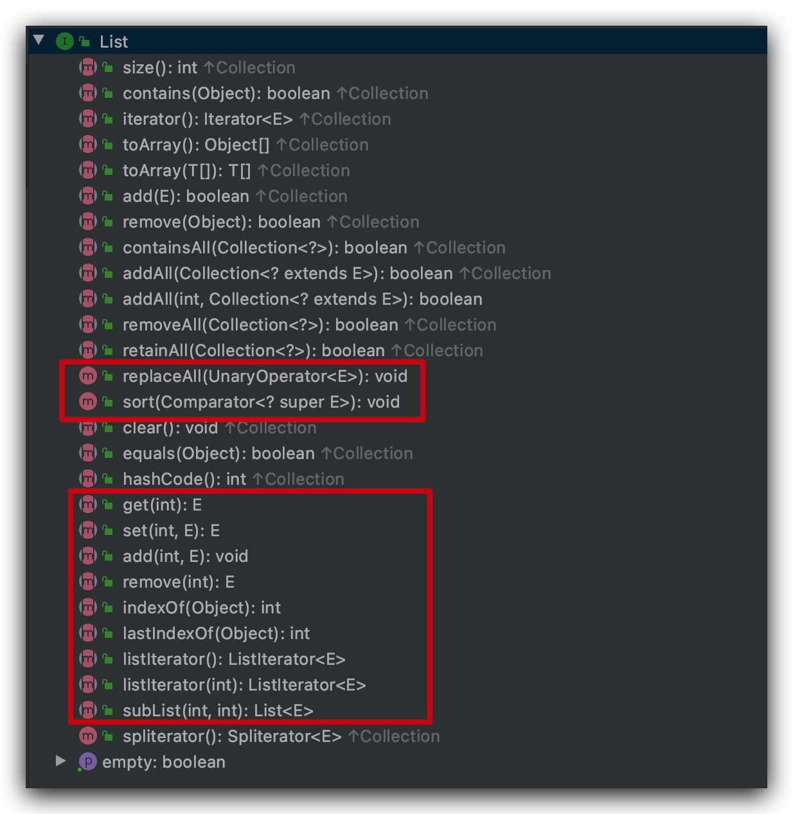
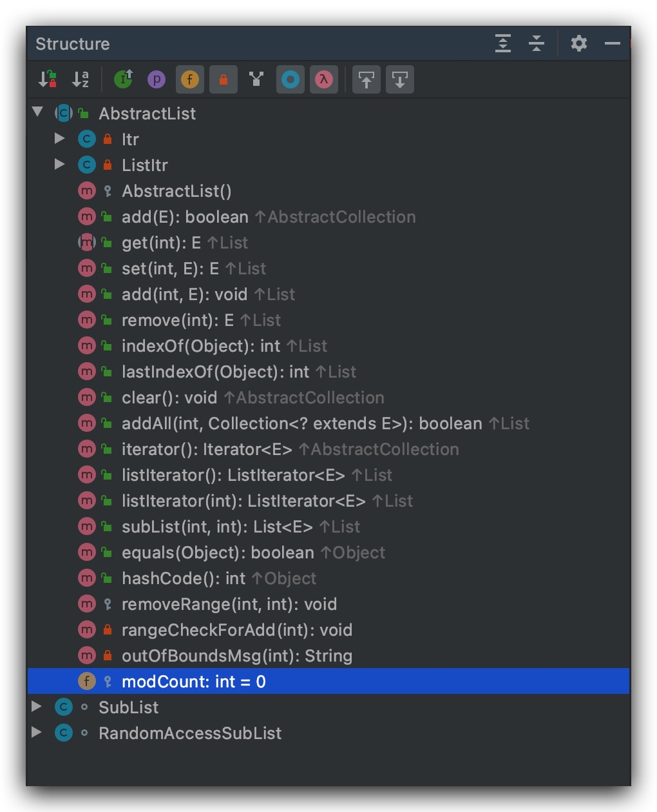

---
# 当前页面内容标题
title: Java源码-005-集合框架-03-ArrayList
# 当前页面图标
icon: java
# 分类
category:
  - Java
  - ArrayList
  - 集合
# 标签
tag:
  - Java
  - ArrayList
  - 集合
sticky: false
# 是否收藏在博客主题的文章列表中，当填入数字时，数字越大，排名越靠前。
star: false
# 是否将该文章添加至文章列表中
article: true
# 是否将该文章添加至时间线中
timeline: true
---

# Java源码-005-集合框架-03-ArrayList

## 概述

`ArrayList`是`List`的一种实现，底层使用的是数组，具有数组的性质：

- 检索和修改快，插入和删除慢
- 可以使用尾插法，插入速度变快
- 使用的是连续的内存空间，对存储要求高
- 元素有序且可重复

### 类继承关系图



### 说明

- `AbstractCollection`实现了`Collection`部分方法

  

- `List`接口定制扩展了`Collection`，使得具有**元素有序、可重复的性质**

  

- `Cloneable`此接口接口实现主要是为了实现对象拷贝功能

- `AbstractList`抽象类实现了迭代器、随机访问、快速失败机制

  

- **`RandomAccess`和`java.io.Serializable`为标记接口，前者标识可随机访问通常用户底层是数组，存在索引的数据接口，后者是序列化标识接口。**

## `ArrayList`源码

### 属性说明

```java
 		/**
	   * 默认初始化容量10
     */
    private static final int DEFAULT_CAPACITY = 10;

    /**
	   * 空，用于创建共享空数组实例。
     */
    private static final Object[] EMPTY_ELEMENTDATA = {};

    /**
	 	 * 用于默认大小的空实例的共享空数组实例。
	 	 * 将其与EMPTY_ELEMENTDATA区分开来，作为判断第一次添加数据时容量开辟的条件
     */
    private static final Object[] DEFAULTCAPACITY_EMPTY_ELEMENTDATA = {};

    /**
	 	 * 存储ArrayList元素的数组缓冲区。ArrayList的容量是此数组缓冲区的长度。
	 	 * 被transient标识，不会被ObjectOutputStream序列化，如果需要网络传输需要重写
	 	 * writeObject和readObject方法
     */
    transient Object[] elementData; // non-private to simplify nested class access

    /**
     * 元素个数
     */
    private int size;

		/**
     * 要分配的数组的最大大小。这个由具体的VM决定可能会失败，
     * OutOfMemoryError：请求的数组大小超过VM限制
     */
    private static final int MAX_ARRAY_SIZE = Integer.MAX_VALUE - 8;
```

### 构造方法

```java
		/**
     * 构造具有指定初始容量的空列表。
     */
    public ArrayList(int initialCapacity) {
        if (initialCapacity > 0) {
            // 指定容量初始化
            this.elementData = new Object[initialCapacity];
        } else if (initialCapacity == 0) {
            // 指定0使用EMPTY数组
            this.elementData = EMPTY_ELEMENTDATA;
        } else {
            throw new IllegalArgumentException("Illegal Capacity: "+
                                               initialCapacity);
        }
    }

    /**
	   * 构造一个初始容量为十的空列表。
     */
    public ArrayList() {
      	// 使用DEFAULTCAPACITY_EMPTY_ELEMENTDATA
      	// 将其与EMPTY_ELEMENTDATA区分开来，作为判断第一次添加数据时容量开辟的条件
        this.elementData = DEFAULTCAPACITY_EMPTY_ELEMENTDATA;
    }

    /**
     * 构造一个包含指定集合的元素的列表，按照它们由集合的迭代器返回的顺序。
     */
    public ArrayList(Collection<? extends E> c) {
       // 集合转数组 
        elementData = c.toArray();
        if ((size = elementData.length) != 0) {
            // c.toArray might (incorrectly) not return Object[] (see 6260652)
            // toArray不一定转化为Object[]，这里添加了判断
            if (elementData.getClass() != Object[].class)
                elementData = Arrays.copyOf(elementData, size, Object[].class);
        } else {
            // 指定0使用EMPTY数组
            this.elementData = EMPTY_ELEMENTDATA;
        }
    }
```

### 数据添加和扩容

```java
		/**
     * 将指定的元素追加到此列表的末尾
     */
    public boolean add(E e) {
    	// 容量判断
        ensureCapacityInternal(size + 1);  // Increments modCount!!
        elementData[size++] = e;
        return true;
    }


private void ensureCapacityInternal(int minCapacity) {
    	// 当且仅当使用无参构造方法创建ArrayList并且第一次调用add()时触发
        if (elementData == DEFAULTCAPACITY_EMPTY_ELEMENTDATA) {
        	// 默认容量10
            minCapacity = Math.max(DEFAULT_CAPACITY, minCapacity);
        }
		// 容量处理
        ensureExplicitCapacity(minCapacity);
    }

    private void ensureExplicitCapacity(int minCapacity) {
        modCount++;
				// 最小容量 = 素数个数+1
        if (minCapacity - elementData.length > 0)
        	  // 扩容
            grow(minCapacity);
    }
		/**
     * 扩容
     */
    private void grow(int minCapacity) {
        // overflow-conscious code
        int oldCapacity = elementData.length;
        // 新的容量时原来的1.5倍
        int newCapacity = oldCapacity + (oldCapacity >> 1);
        // 新的容量比最小容量还小
        if (newCapacity - minCapacity < 0)
            newCapacity = minCapacity;
        // 新容量比
        if (newCapacity - MAX_ARRAY_SIZE > 0)
        	// 最大容量分配
            newCapacity = hugeCapacity(minCapacity);
        // minCapacity is usually close to size, so this is a win:
        elementData = Arrays.copyOf(elementData, newCapacity);
    }

    /**
     * 最大限度扩容
     */
    private static int hugeCapacity(int minCapacity) {
        if (minCapacity < 0) // overflow
            throw new OutOfMemoryError();
        return (minCapacity > MAX_ARRAY_SIZE) ?
            Integer.MAX_VALUE :
            MAX_ARRAY_SIZE;
    }
```

### 数据获取

```java
		/**
     * 获取指定索引的元素。
     */
    public E get(int index) {
    		// 索引越界判断
        rangeCheck(index);
				// 直接通过索引获取元素返回，时间复杂度O1
        return elementData(index);
    }
		private void rangeCheck(int index) {
        if (index >= size)
            throw new IndexOutOfBoundsException(outOfBoundsMsg(index));
    }
```

### 数据删除

```java
    /**
     *  删除元素
     */
    public E remove(int index) {
    	  // 索引校验
        rangeCheck(index);

        modCount++;
        E oldValue = elementData(index);
		   // 要移动的数组元素的数量
        int numMoved = size - index - 1;
        if (numMoved > 0)
            System.arraycopy(elementData, index+1, elementData, index,
                             numMoved);
        // 赋值null待GC 
        elementData[--size] = null; // clear to let GC do its work
        return oldValue;
    }

		/**
     * 数组数据拷贝
     * @param      src      源数组
     * @param      srcPos   源数组起始位置
     * @param      dest     目标数组
     * @param      destPos  目标数组中的起始位置
     * @param      length   要复制的数组元素的数量
     */
    public static native void arraycopy(Object src,  int  srcPos,
                                        Object dest, int destPos,
                                        int length);
```

### 集合清除clear

> 删除此列表中的所有元素。此调用返回后，列表的元素为空，但列表的容量还存在待GC回收。

```java
/**
 * 删除此列表中的所有元素。此调用返回后，列表的元素为空，但列表的容量还存在待GC回收。
 */
public void clear() {
    modCount++;

    // clear to let GC do its work
    for (int i = 0; i < size; i++)
        elementData[i] = null;
		// 元素个数重值0
    size = 0;
}
```
