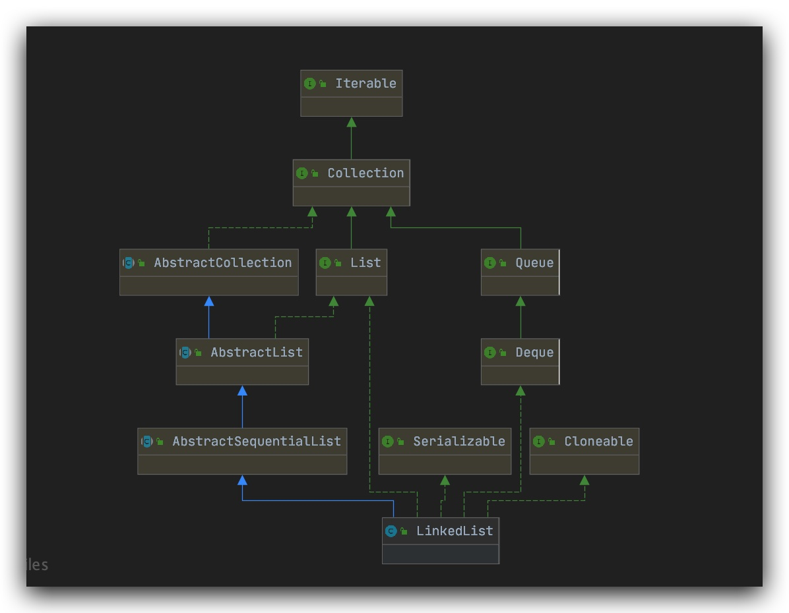
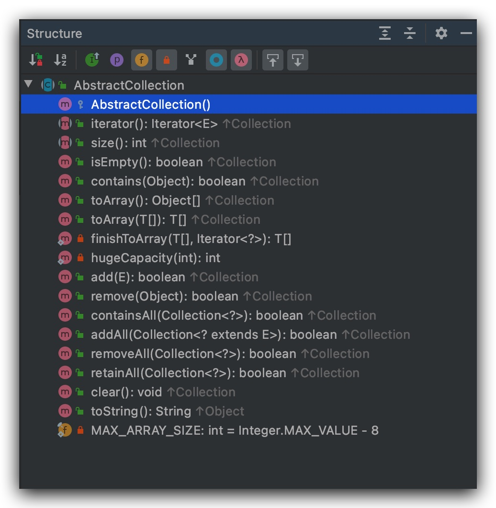
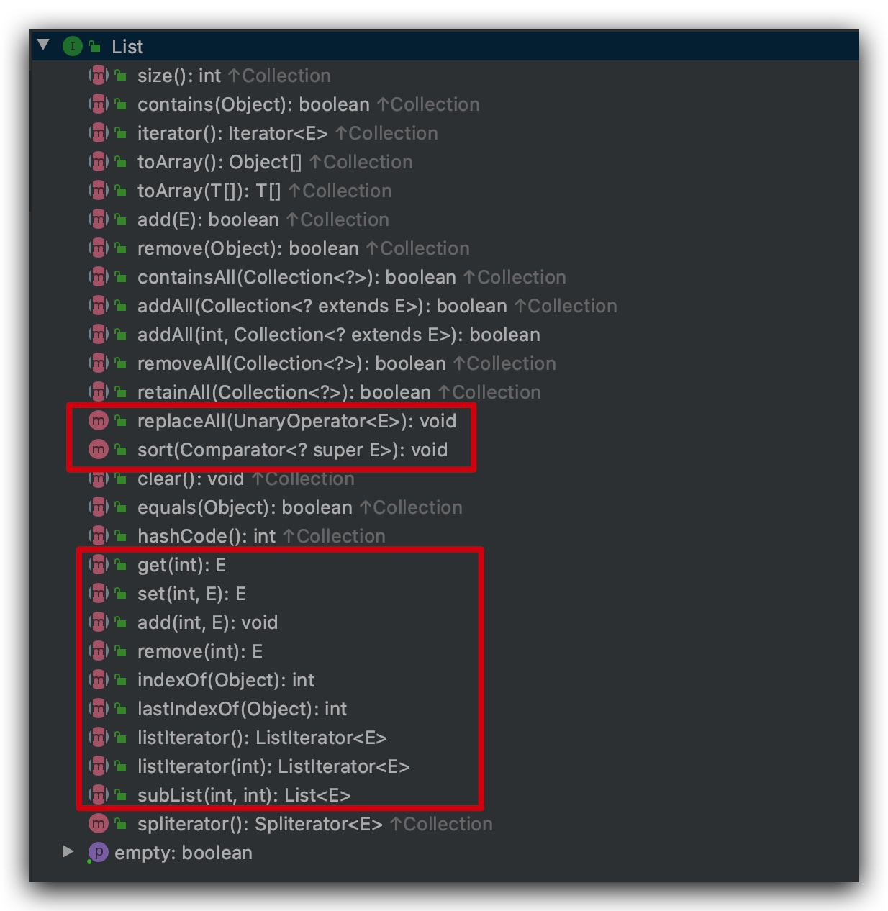
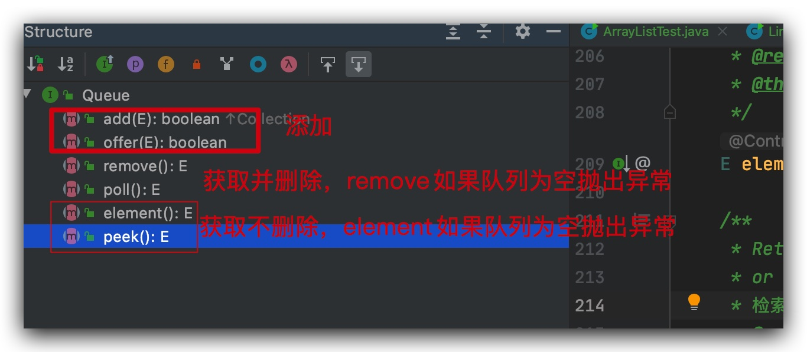
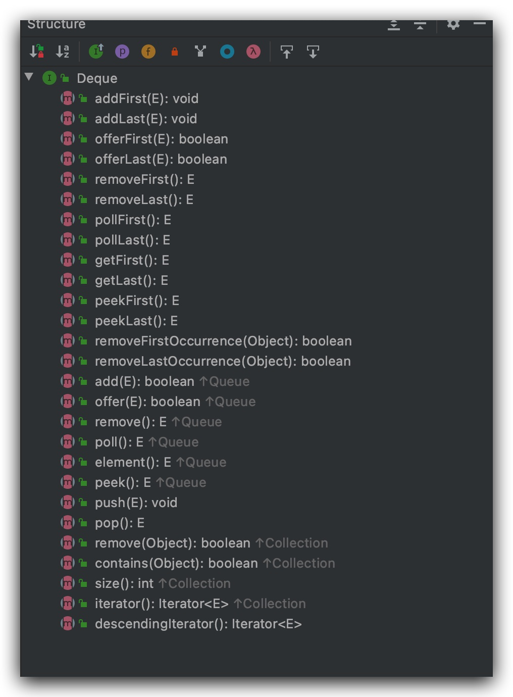
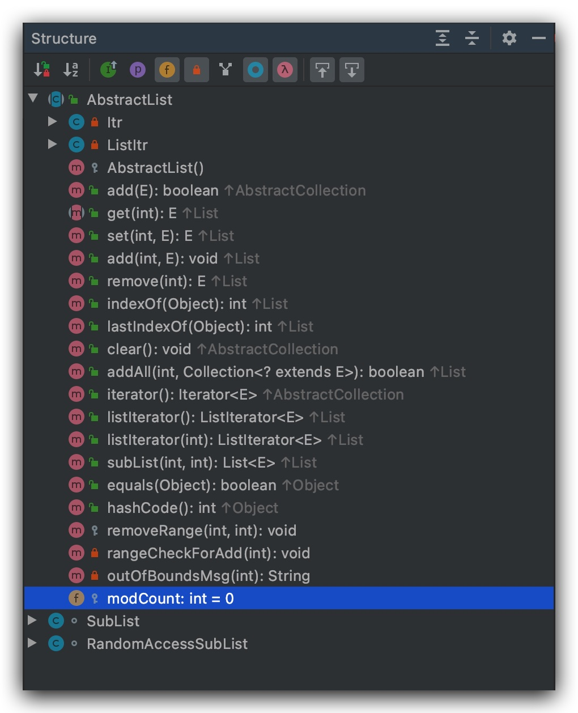

---
# 当前页面内容标题
title: Java源码-005-集合框架-04-LinkedList
# 当前页面图标
icon: java
# 分类
category:
  - Java
  - LinkedList
  - 集合
# 标签
tag:
  - Java
  - LinkedList
  - 集合
sticky: false
# 是否收藏在博客主题的文章列表中，当填入数字时，数字越大，排名越靠前。
star: false
# 是否将该文章添加至文章列表中
article: true
# 是否将该文章添加至时间线中
timeline: true
---

# Java源码-005-集合框架-04-LinkedList

## 概述

`LinkedList`是`List`的一种实现，底层使用的是链表，具有链表的性质：

- 检索和修改慢，插入和删除快
- 使用头尾节点操作可以提高效率
- 使用的是不连续的内存空间，对存储要求低
- 元素有序且可重复

### 类继承关系图



### 说明

- `AbstractCollection`实现了`Collection`部分方法

  

- `List`接口定制扩展了`Collection`，使得具有**元素有序、可重复的性质**

  

- `Queue`此接口定义了队列的功能方法。弹出和检索

  

- `Deque`此接口定义了双端队列的功能方法

  

- `Cloneable`此接口实现主要是为了实现对象拷贝功能

- `AbstractList`抽象类实现了迭代器、随机访问、快速失败机制

  

- **`java.io.Serializable`为序列化标记接口**

- **`AbstractSequentialList`通过迭代器实现类似数组的下标操作**

  

## `LinkedList`源码

### 属性说明

```java
 		/**
	 * 列表元素个数
	 */
    transient int size = 0;

    /**
	   * 头指针
     */
    transient Node<E> first;

    /**
	 	 * 尾指针
     */
    transient Node<E> last;
```

### 构造方法

```java
		/**
     * 无参构造方法
     */
    public LinkedList() {
    }

    /**
     * 按集合迭代器返回的顺序构造包含指定集合元素的列表。
     */
    public LinkedList(Collection<? extends E> c) {
        this();
        addAll(c);
    }
```

### 数据添加和扩容

```java
		/**
     * 将指定的元素追加到此列表的末尾
     */
    public boolean add(E e) {
    	// 容量判断
        ensureCapacityInternal(size + 1);  // Increments modCount!!
        elementData[size++] = e;
        return true;
    }


private void ensureCapacityInternal(int minCapacity) {
    	// 当且仅当使用无参构造方法创建ArrayList并且第一次调用add()时触发
        if (elementData == DEFAULTCAPACITY_EMPTY_ELEMENTDATA) {
        	// 默认容量10
            minCapacity = Math.max(DEFAULT_CAPACITY, minCapacity);
        }
		// 容量处理
        ensureExplicitCapacity(minCapacity);
    }

    private void ensureExplicitCapacity(int minCapacity) {
        modCount++;
				// 最小容量 = 素数个数+1
        if (minCapacity - elementData.length > 0)
        	  // 扩容
            grow(minCapacity);
    }
		/**
     * 扩容
     */
    private void grow(int minCapacity) {
        // overflow-conscious code
        int oldCapacity = elementData.length;
        // 新的容量时原来的1.5倍
        int newCapacity = oldCapacity + (oldCapacity >> 1);
        // 新的容量比最小容量还小
        if (newCapacity - minCapacity < 0)
            newCapacity = minCapacity;
        // 新容量比
        if (newCapacity - MAX_ARRAY_SIZE > 0)
        	// 最大容量分配
            newCapacity = hugeCapacity(minCapacity);
        // minCapacity is usually close to size, so this is a win:
        elementData = Arrays.copyOf(elementData, newCapacity);
    }

    /**
     * 最大限度扩容
     */
    private static int hugeCapacity(int minCapacity) {
        if (minCapacity < 0) // overflow
            throw new OutOfMemoryError();
        return (minCapacity > MAX_ARRAY_SIZE) ?
            Integer.MAX_VALUE :
            MAX_ARRAY_SIZE;
    }
```

### 数据获取

```java
		/**
     * 获取指定索引的元素。
     */
    public E get(int index) {
    		// 索引越界判断
        rangeCheck(index);
				// 直接通过索引获取元素返回，时间复杂度O1
        return elementData(index);
    }
		private void rangeCheck(int index) {
        if (index >= size)
            throw new IndexOutOfBoundsException(outOfBoundsMsg(index));
    }
```

### 数据删除

```java
    /**
     *  删除元素
     */
    public E remove(int index) {
    	  // 索引校验
        rangeCheck(index);

        modCount++;
        E oldValue = elementData(index);
		   // 要移动的数组元素的数量
        int numMoved = size - index - 1;
        if (numMoved > 0)
            System.arraycopy(elementData, index+1, elementData, index,
                             numMoved);
        // 赋值null待GC 
        elementData[--size] = null; // clear to let GC do its work
        return oldValue;
    }

		/**
     * 数组数据拷贝
     * @param      src      源数组
     * @param      srcPos   源数组起始位置
     * @param      dest     目标数组
     * @param      destPos  目标数组中的起始位置
     * @param      length   要复制的数组元素的数量
     */
    public static native void arraycopy(Object src,  int  srcPos,
                                        Object dest, int destPos,
                                        int length);
```

### 集合清除clear

> 删除此列表中的所有元素。此调用返回后，列表的元素为空，但列表的容量还存在待GC回收。

```java
/**
 * 删除此列表中的所有元素。此调用返回后，列表的元素为空，但列表的容量还存在待GC回收。
 */
public void clear() {
    modCount++;

    // clear to let GC do its work
    for (int i = 0; i < size; i++)
        elementData[i] = null;
		// 元素个数重值0
    size = 0;
}
```

